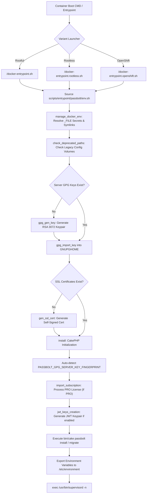

# Passbolt Docker Architecture Documentation

Welcome to the technical architecture documentation for the [`passbolt_docker`](file:///C:/Users/echavez/Projects/Passbolt/passbolt_docker) repository. This document provides an in-depth breakdown of the container image architecture, entrypoint lifecycle, configuration model, build variants, environment variable configuration, and testing suite.

---

## 1. System Overview & Core Stack

`passbolt_docker` provides official Docker image packaging for **Passbolt**, an open-source, team-first password manager built on PHP (CakePHP framework) and GnuPG cryptography.

### Core Stack Components

| Component | Technology / Version | Role / Purpose |
|---|---|---|
| **Base Operating System** | Debian 13 (Trixie Slim) | Lightweight, security-patched Linux base image |
| **Web Server** | NGINX | Reverse proxy, static asset delivery, SSL termination |
| **Application Server** | PHP 8.4 FPM | Executes Passbolt CakePHP backend application (`passbolt-ce-server` / `passbolt-pro-server`) |
| **Process Manager** | Supervisord | PID 1 init system supervising NGINX, PHP-FPM, and Cron workers |
| **Crypto Engine** | GnuPG (GPG) | Handles server-side OpenPGP key pair generation, key imports, and verification |
| **Scheduled Tasks** | Cron / Supercronic | Runs periodic background jobs (email dispatch, queue processing, health checks) |

---

## 2. Directory & Repository Structure

```
passbolt_docker/
├── .github/
│   └── workflows/              # GitHub Actions CI/CD pipelines
│       ├── push_pr_main.yaml   # Continuous Integration workflow (PRs & main)
│       └── release.yaml        # Automated Docker Hub release workflow
├── ci-scripts/                 # CI helper utilities
│   └── bin/
│       └── slack-status-messages.sh
├── conf/                       # Service configuration templates
│   ├── php/
│   │   └── zz-docker.conf      # Custom PHP-FPM pool settings
│   ├── supervisor/
│   │   ├── cron.conf           # Standard root Cron supervisor worker
│   │   ├── cron.conf.rootless  # Supercronic rootless supervisor worker
│   │   ├── nginx.conf          # NGINX supervisor worker
│   │   └── php.conf            # PHP-FPM supervisor worker
│   ├── passbolt.conf           # NGINX site virtual host configuration
│   └── xdebug.ini              # Development Xdebug configuration
├── debian/                     # Container build definitions (Dockerfiles)
│   ├── Dockerfile              # Standard Debian (Rootful, ports 80/443)
│   ├── Dockerfile.rootless     # Unprivileged Debian (User www-data, ports 8080/4433)
│   └── Dockerfile.openshift    # OpenShift Container Platform compatible variant
├── docker-compose/             # Ready-to-use Docker Compose stack files
│   ├── docker-compose-ce.yaml             # Passbolt CE + MariaDB 10.11
│   ├── docker-compose-ce-postgresql.yaml  # Passbolt CE + PostgreSQL
│   └── docker-compose-pro.yaml            # Passbolt PRO + MariaDB
├── scripts/                    # Entrypoint and setup scripts
│   ├── entrypoint/
│   │   ├── docker-entrypoint.sh           # Main entrypoint wrapper (Rootful)
│   │   ├── docker-entrypoint.rootless.sh  # Main entrypoint wrapper (Rootless)
│   │   ├── docker-entrypoint.openshift.sh # Main entrypoint wrapper (OpenShift)
│   │   └── passbolt/
│   │       ├── entrypoint.sh              # Core setup logic (GPG, SSL, DB, JWT)
│   │       ├── entrypoint-rootless.sh     # Rootless setup logic adjustment
│   │       ├── entrypoint-openshift.sh    # OpenShift setup logic adjustment
│   │       ├── env.sh                     # Docker secrets & env resolution helpers
│   │       └── deprecated_paths.sh        # Warning logger for legacy configuration paths
│   └── wait-for.sh                        # TCP socket readiness check utility
├── spec/                       # Automated test suite (RSpec + ShellSpec)
│   ├── docker_image/           # RSpec image build validation tests
│   ├── docker_runtime/         # RSpec container runtime behavior tests
│   ├── shell/                  # ShellSpec unit tests for entrypoint functions
│   └── spec_helper.rb          # Test suite helper configuration
├── CHANGELOG.md                # Release history and revision notes
├── Gemfile                     # Ruby dependencies for test suite execution
├── LICENSE                     # GNU Affero General Public License v3.0
├── Rakefile                    # Rake tasks for spec orchestration
└── README.md                   # Quickstart deployment and configuration guide
```

---

## 3. Container Image Variants

`passbolt_docker` supports three primary Docker image build targets:

| Feature / Property | Standard Debian (`debian/Dockerfile`) | Rootless Debian (`debian/Dockerfile.rootless`) | OpenShift Variant (`debian/Dockerfile.openshift`) |
|---|---|---|---|
| **User Context** | `root` (switches to `www-data` for CakePHP) | `www-data` (UID 33 / GID 33) | Dynamic OpenShift UID |
| **HTTP Port** | `80` | `8080` | `8080` |
| **HTTPS Port** | `443` | `4433` | `4433` |
| **Task Scheduler** | System `cron` daemon | [`supercronic`](https://github.com/aptible/supercronic) | `supercronic` |
| **PID / Temp Paths** | `/run/nginx.pid`, `/var/run/supervisor.sock` | `/tmp/nginx.pid`, `/tmp/supervisor.sock` | `/tmp/nginx.pid`, `/tmp/supervisor.sock` |
| **Supervisord Socket** | `/var/run/supervisor.sock` | `/tmp/supervisor.sock` | `/tmp/supervisor.sock` |
| **Primary Target** | Standard Docker / Docker Compose / VM deployments | Hardened / Unprivileged K8s & Docker hosts | Red Hat OpenShift Container Platform |

---

## 4. Container Entrypoint & Lifecycle

When a Passbolt container boots, it runs the entrypoint wrapper script. The complete execution lifecycle operates as follows:



### Step-by-Step Entrypoint Execution Logic

1. **Docker Secrets Resolution (`env.sh`)**:
   - `env_from_file`: Reads `_FILE` environment variables (e.g. `DATASOURCES_DEFAULT_PASSWORD_FILE=/run/secrets/db-pass`) and exports the resolved value to `DATASOURCES_DEFAULT_PASSWORD`.
   - `secret_file_to_path`: Symlinks Docker secret files to required configuration destinations (e.g. `PASSBOLT_SSL_SERVER_CERT_FILE` -> `/etc/ssl/certs/certificate.crt`).

2. **GnuPG Server Keypair Provisioning (`entrypoint.sh`)**:
   - Checks if GPG server keys exist at `/etc/passbolt/gpg/serverkey_private.asc` and `/etc/passbolt/gpg/serverkey.asc`.
   - If missing, `gpg_gen_key` uses `gpg --batch` to non-interactively generate a 3072-bit RSA master and subkey pair owned by `PASSBOLT_KEY_NAME` and `PASSBOLT_KEY_EMAIL`.
   - Keypairs are automatically imported into `$GNUPGHOME` (`/var/lib/passbolt/.gnupg`).

3. **SSL Certificate Provisioning**:
   - Checks `/etc/ssl/certs/certificate.crt` and `/etc/ssl/certs/certificate.key` (or `/etc/passbolt/certs/` for rootless).
   - If unmounted, `gen_ssl_cert` uses `openssl` to generate a 365-day self-signed SSL certificate for `www.passbolt.local`.

4. **Application Installation & Migration**:
   - Extracts GPG fingerprint via `gpg --list-keys --with-colons`.
   - Imports subscription file (for Passbolt PRO) via `bin/cake passbolt subscription_import`.
   - Generates JWT keypair via `bin/cake passbolt create_jwt_keys`.
   - Runs `bin/cake passbolt install --no-admin` for new installations, or `bin/cake passbolt migrate --no-clear-cache` for existing databases.

5. **Process Handoff**:
   - Exports environment state to `/etc/environment`.
   - Executes `/usr/bin/supervisord -n` as PID 1 to manage process lifetime.

---

## 5. Configuration & Environment Variables Reference

Passbolt containers are driven by environment variables or mounted files:

### Essential Database Variables
- `DATASOURCES_DEFAULT_HOST`: Database hostname or IP (default: `localhost`).
- `DATASOURCES_DEFAULT_PORT`: Database port (default: `3306`).
- `DATASOURCES_DEFAULT_USERNAME`: Database user account.
- `DATASOURCES_DEFAULT_PASSWORD`: Database user password (or via `DATASOURCES_DEFAULT_PASSWORD_FILE`).
- `DATASOURCES_DEFAULT_DATABASE`: Database name (e.g., `passbolt`).

### Application & Security Variables
- `APP_FULL_BASE_URL`: Fully qualified domain URL including scheme (e.g. `https://passbolt.example.com`).
- `PASSBOLT_KEY_EMAIL`: Email address for auto-generated GPG key (default: `passbolt@yourdomain.com`).
- `PASSBOLT_KEY_NAME`: Owner name for auto-generated GPG key (default: `Passbolt default user`).
- `PASSBOLT_KEY_LENGTH` / `PASSBOLT_SUBKEY_LENGTH`: Bit length for auto-generated RSA key (default: `3072`).
- `PASSBOLT_GPG_SERVER_KEY_FINGERPRINT`: Manual GPG server key fingerprint override.
- `SUBSCRIPTION_KEY`: Base64 encoded subscription license string (PRO version).

### Volume Mount Paths
- `/etc/passbolt/gpg`: Persistent storage for GPG server keys (`serverkey.asc`, `serverkey_private.asc`).
- `/etc/passbolt/jwt`: Persistent storage for JWT authentication keypairs (`jwt.key`, `jwt.pem`).
- `/var/lib/mysql`: MariaDB database persistence (in Docker Compose setups).

---

## 6. Testing & Quality Assurance

The codebase includes comprehensive automated testing frameworks:

### ShellSpec (Shell Script Unit Testing)
Unit tests validate internal entrypoint bash function behavior without requiring Docker daemon execution.
- Specs located in [`spec/shell/entrypoint/`](file:///C:/Users/echavez/Projects/Passbolt/passbolt_docker/spec/shell/entrypoint).
- To execute ShellSpec:
  ```bash
  shellspec
  ```

### Serverspec / RSpec (Integration & Runtime Testing)
System tests build Docker images and launch live containers to verify runtime health, permissions, ports, and healthchecks.
- Specs located in [`spec/docker_image/`](file:///C:/Users/echavez/Projects/Passbolt/passbolt_docker/spec/docker_image) and [`spec/docker_runtime/`](file:///C:/Users/echavez/Projects/Passbolt/passbolt_docker/spec/docker_runtime).
- To execute via Rake:
  ```bash
  PASSBOLT_FLAVOUR=ce PASSBOLT_COMPONENT=stable ROOTLESS=false bundle exec rake spec
  ```

---

## 7. CI/CD Workflows

Continuous Integration is driven by GitHub Actions:
- [`.github/workflows/push_pr_main.yaml`](file:///C:/Users/echavez/Projects/Passbolt/passbolt_docker/.github/workflows/push_pr_main.yaml): Triggers on PRs and merges into `main`. Runs ShellSpec and Serverspec test matrix against CE/PRO and root/rootless variants.
- [`.github/workflows/release.yaml`](file:///C:/Users/echavez/Projects/Passbolt/passbolt_docker/.github/workflows/release.yaml): Handles release tags and pushes built multi-arch Docker images to Docker Hub.
